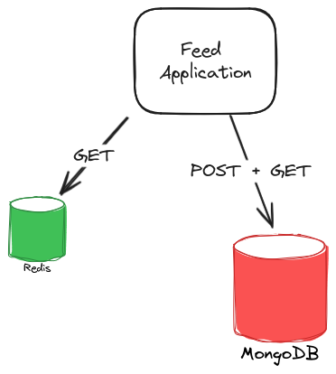

#  📝 Simple Feed System 

## Description

The system is a REST API server that provides CREATE and READ operations for feed of posts 🏣.

## Objective

The Goal of the project as mentioned above is to provide the next functions:

- Create a post
- Get posts ordered by creation date and filtered by parameters as start and limit
- Get number of posts
- Get top creators
- Get average runtime for first two operations
  <br><br>
  Also there was a requirement for the server to be able to withstand high amount of requests.

## Considerations and system overview

#### Language

I chose **NestJS** because it allowed me to quickly develop the functionality of the server.
<br>The API, testing, database integration and useful middleware for validations,
specifically the runtime interceptors for the metrics gathering.<br><br>

#### Database

The Database of my choice was **MongoDB**.<br>
In the case of such a small application, there wouldn't be much difference between RDMBS and NoSQL databases.<br>
PostgreSQL for example could be used(and would even be able to scale horizontally) just fine for this task.<br>
_But_  - MongoDB was a good choice for:<br>

- Simplicity for quering ,specifically aggregations for metrics gathering in our case.
- Ability to scale horizontally(sharding or replication)
- Potentially querying big chunks of data(GET /posts for example)
<br> 

#### Design



The application is a single NestJS service.<br><br>
I chose to keep it simple and to use caching via **Redis** for boosting performance.<br><br>
I thought about implementing CQRS, event sourcing, or even splitting modules into different microservices and setup MQ.<br>
For complex read and write operations with different optimization requirements, CQRS might be a good fit. <br>
That would definitely tackle the problem of scale read and write operations independently.<br><br>
However, I think it would be an overkill for a small REST API with just a "post" entity and simple operations,<br>
but for some performance we would still want to lower the latency of requests.<br>
How'd we do that? Caching would be a great way to improve the app's performance and to tackle high read rate.<br>
<br>
**_Note_**: The cache might interfere with the "desired" functionality of the statistics(the GET /posts is cached).

### Additional

In order to ease the setup I'm using docker compose for the DB and Cache.

## Documentation

Your'e welcome to examine the documentation at [OPEN API URL]
right after you have run the application.

## Installation

```bash
$ npm install
```

## Running the app

```bash
#setup database and redis
$ docker compose up -d

#After the containers are created - continue
# development
$ npm run start

# watch mode
$ npm run start:dev

# production mode
$ npm run start:prod
```
Instructions for running the project. Include details on configuration, environment variables, or any other relevant information.

## Test
 #### **I also added Postman collection tests which i've used, maybe you'll find it helpful too. [POSTMAN_FILE] **

```bash
# unit tests
$ npm run test

# e2e tests
$ npm run test:e2e

# test coverage
$ npm run test:cov
```

 [OPEN API URL]: localhost:3000/api
 [POSTMAN_FILE]: feed-api-calls.postman_collection.json